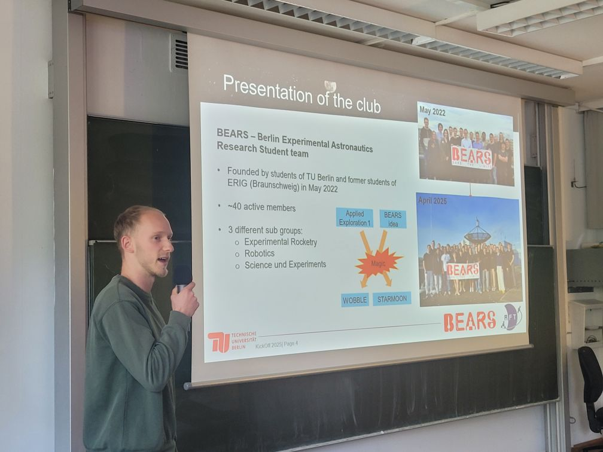
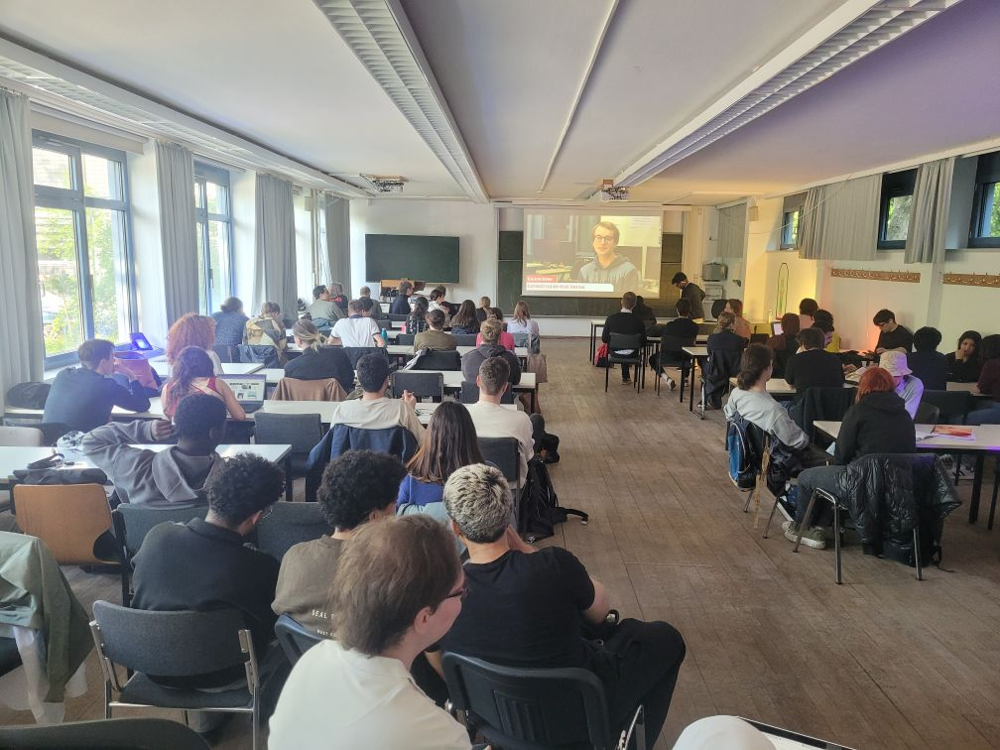

You are not a BEARS member yet, but want to become one? Or you just want to get to know our projects better? Or want to connect to current BEARS members? If so, you will be at the right place in Building EB, Room EB317c (Weltraum) of TU Berlin on the 28th of April at 6pm!

{width=60%}

We will present all relevant projects and welcome everyone warmly. Stay tuned, maybe there will be a small surprise? (Like snacks? Or a free Science Fiction novel? Or a hidden rocket? Only those, who will join, will know … See you!)

{width=80%}